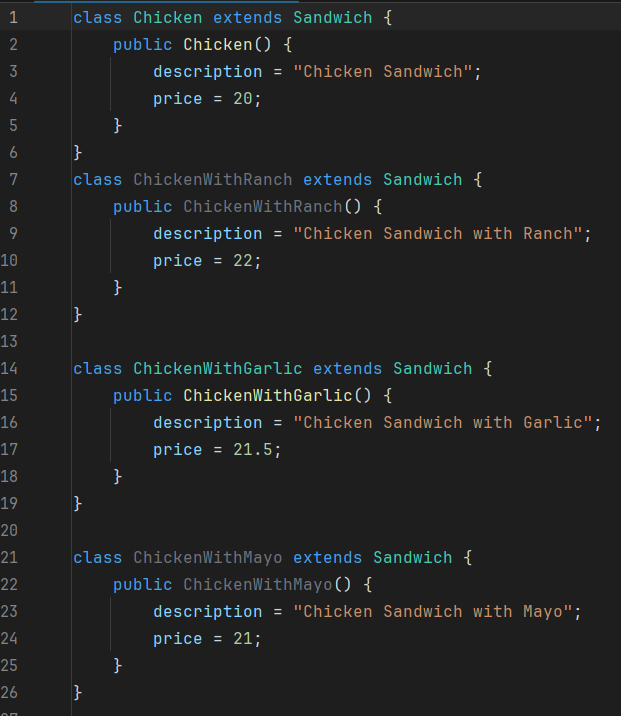
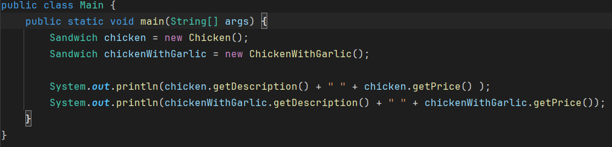
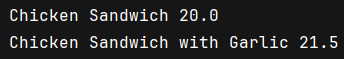
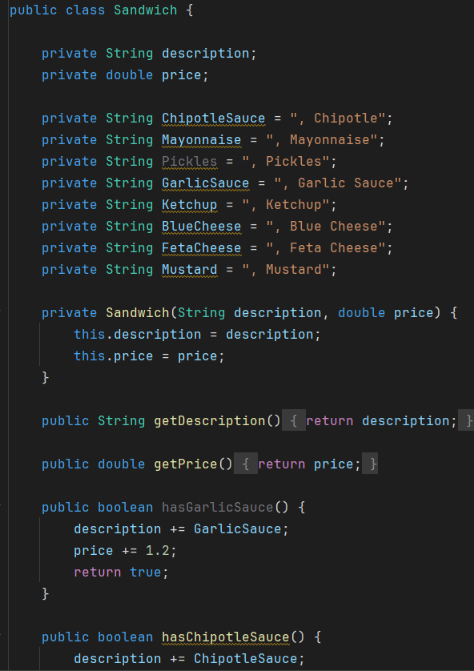
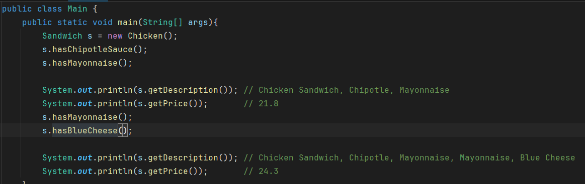
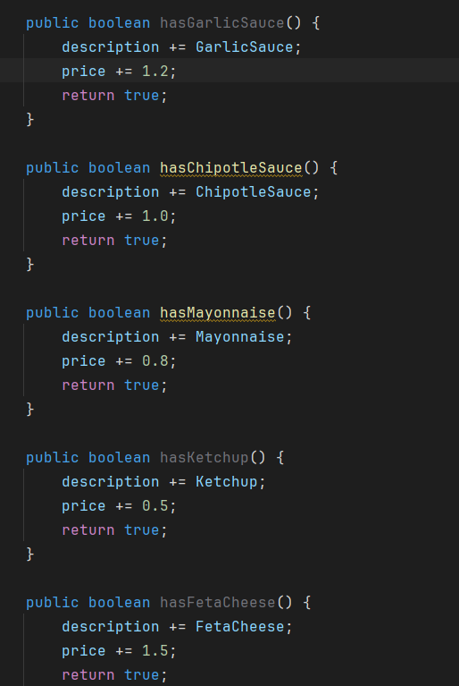
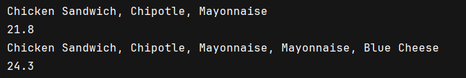
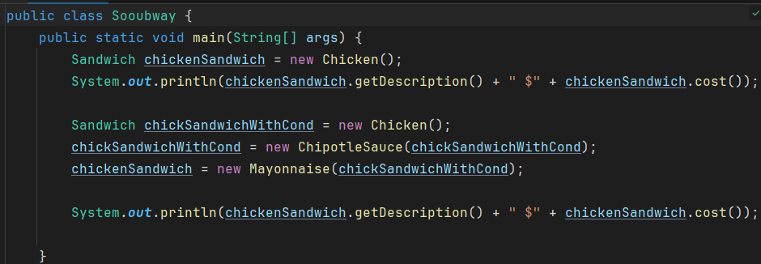
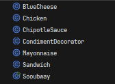
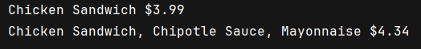

# Different Approach - Decorator Design Pattern
In the provided examples, I used 3 approaches to illustrate different ways of how can we modify an object behavior.

>- Class Explosion: every variation has its own subclass
>- Boolean: all the variation of the object live inside its class, mutating its own variables
>- Decorator: behavior is added by wrapping objects inside other objects, without mutating the original.


# Approach 1 - Class Explosion/Inheritance
in this approach, each sandwich and condiment have its own class as well as extending from the parent class "`Sandwich`"

```Sandwich
├── Chicken
│   ├── ChickenWithRanch
│   ├── ChickenWithGarlic
│   ├── ChickenWithMayo
│   ├── ChickenWithKetchup
│   └── ChickenWithMustard
├── Veggie
│   ├── VeggieWithRanch
│   └── ...
├── Tuna
├── Steak
└── Turkey
```



## Implementation


`Output`




**This approach flaws lies in:** 
>* Readability, creating a lot of almost identical classes.
>*  If you want to add a new condiment, you will have to add them to modify 5 classes `Steak`,`Tuna`,`Turkey`,`Veggie`
>and `Chicken`. and vice versa for adding a new type of sandwich, **which will result in difficulty in maintaining**.
>* Violating Open-Closed principle, where adding a new condiment/sandwich type, will force you to modify the already existing classes rather than adding new behavior.
>* Stackability, you won't be able to stack another condiment once you add one.

# Approach 2 - Boolean 
in this approach, all the condiments logic will be inside the class `Sandwich` itself.



## Implementation 




`Output`



**This approach flaws lies in:**
* At any point, calling any condiment method, the condiments/description and price would stack, but will change the description permanently mutating the object.
* Violates Open/Closed Principle, where adding a new condiment/sandwich type, will force you to modify the already existing classes rather than adding new behavior.
* a class should only do a job, and do it very well and detailed, adding condiments to `Sandwich` class will make it carry more responsibility, as well as prone to errors.


# Approach 3 - Decorator
Unlike the other two approaches, decorator doesn't mutate the object state, but it adds behavior to it without having to change in existing code.

and it happens by adding a class `CondimentDecorator` beside the extended classes (Sandwich types).
```Sandwich
Sandwich (abstract)
├── Chicken
├── Veggie
├── Tuna
├── Steak
├── Turkey
└── CondimentDecorator (abstract)
    ├── Ranch
    ├── Garlic
    ├── Mayo
    ├── Ketchup
    └── Mustard
```
## Implementation



`Output`



## How it works
At first we make a decorator class `CondimentDecorator` that extends `Sandwich`

For example, the class `Steak` is never touched, so if we want to add a new condiment later, we make a class for that condiment, extending the decorator. 

We make a new `Sandwich` Object, then we wrap it with the condiments, making sure we can stack/add behavior to that object
```
Sandwich mmmTastySandwich = new Mayo(new Garlic(new Ranch(new Steak())));
```
## Why this is approach better
>* The object itself isn't mutated, but it received additional behavior. with the ability to still call the base object.
>* Stacking multiple behaviors in any order.
>* Follows Open-Closed principle, adding new condiment means adding new class rather than changing the existing classes.
>* Each class holds a single responsibility.


# Note
> An LLM was used to generate the repetitive subclasses in the Class Explosion approach in the code, as well as the ASCII class tree structures.